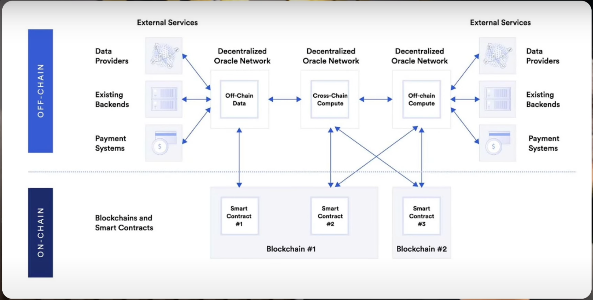

# On-chain & off-chain

**On-chain** và **off-chain** là hai thuật ngữ quan trọng trong blockchain, liên quan đến cách dữ liệu và giao dịch được xử lý và lưu trữ. Dưới đây là định nghĩa và phân biệt giữa chúng:

### **On-Chain**

**On-chain** đề cập đến tất cả các hoạt động và dữ liệu được ghi lại và lưu trữ trực tiếp trên blockchain.

#### **Đặc điểm của On-Chain:**

1. **Lưu trữ và xử lý trên blockchain**: Tất cả các giao dịch, hợp đồng thông minh, và dữ liệu liên quan đều được ghi vào blockchain, làm cho chúng trở nên bất biến và minh bạch.
2. **Bảo mật và minh bạch**: Dữ liệu on-chain được mã hóa và phân phối trên toàn bộ mạng lưới blockchain, giúp tăng cường tính bảo mật và minh bạch.
3. **Chi phí**: Thực hiện các giao dịch on-chain có thể tốn phí gas hoặc phí giao dịch, đặc biệt khi mạng lưới bị tắc nghẽn.
4. **Hiệu suất**: Việc lưu trữ và xử lý dữ liệu trên blockchain có thể làm giảm hiệu suất của hệ thống do giới hạn về kích thước khối và thời gian khối.

### **Off-Chain**

**Off-chain** đề cập đến tất cả các hoạt động và dữ liệu không được lưu trữ hoặc xử lý trực tiếp trên blockchain mà ở ngoài chuỗi.

#### **Đặc điểm của Off-Chain:**

1. **Lưu trữ và xử lý ngoài blockchain**: Dữ liệu hoặc giao dịch off-chain được quản lý và lưu trữ ngoài mạng blockchain, ví dụ như trên cơ sở dữ liệu tập trung hoặc hệ thống lưu trữ khác.
2. **Hiệu suất và chi phí**: Off-chain giúp giảm chi phí giao dịch và tăng hiệu suất vì không phải xử lý và lưu trữ dữ liệu trên blockchain.
3. **Kết nối với blockchain**: Dữ liệu hoặc giao dịch off-chain có thể được đồng bộ hóa với blockchain khi cần thiết thông qua các giải pháp như **oracles** hoặc **các phương pháp đồng bộ hóa** khác.

### **Phân biệt On-Chain và Off-Chain**

| **Tiêu chí**               | **On-Chain**                                                            | **Off-Chain**                                                                  |
| -------------------------- | ----------------------------------------------------------------------- | ------------------------------------------------------------------------------ |
| **Vị trí lưu trữ**         | Trực tiếp trên blockchain.                                              | Ngoài blockchain, như cơ sở dữ liệu tập trung.                                 |
| **Bảo mật**                | Bảo mật cao nhờ vào mã hóa và phân phối trên toàn mạng lưới blockchain. | Bảo mật phụ thuộc vào phương pháp lưu trữ bên ngoài.                           |
| **Chi phí**                | Có thể tốn phí giao dịch (phí gas) và lưu trữ dữ liệu.                  | Thường có chi phí thấp hơn vì không phụ thuộc vào phí blockchain.              |
| **Hiệu suất**              | Có thể bị ảnh hưởng do giới hạn về kích thước khối và thời gian khối.   | Có thể nhanh hơn và ít tốn tài nguyên hơn vì không phải xử lý trên blockchain. |
| **Minh bạch**              | Minh bạch và không thể thay đổi vì dữ liệu được ghi vào blockchain.     | Dữ liệu không được ghi vào blockchain, nên tính minh bạch thấp hơn.            |
| **Kết nối với blockchain** | Tất cả dữ liệu và giao dịch đều nằm trên blockchain.                    | Có thể đồng bộ hóa với blockchain qua các giải pháp như oracles.               |

### **Ứng dụng thực tiễn:**

- **On-Chain**: Giao dịch tiền điện tử, hợp đồng thông minh, và các ứng dụng dApps cần tính bảo mật cao và minh bạch.
- **Off-Chain**: Lưu trữ dữ liệu lớn, xử lý giao dịch nhanh và hiệu quả hơn mà không cần lưu trữ trên blockchain.

Cả hai phương pháp có thể được sử dụng đồng thời để tận dụng các lợi ích của mỗi phương pháp, chẳng hạn như sử dụng off-chain để lưu trữ dữ liệu lớn và on-chain để ghi lại các giao dịch quan trọng.
